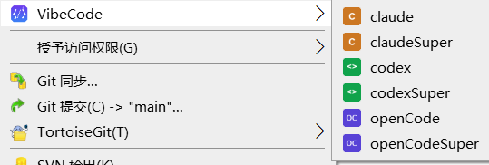

# VibeCode Context Menu

Windows 右键菜单管理工具，为文件夹快速启动各种 AI CLI 工具。

## 目录结构

```
VibeCodeContextMenu/
├── VibeCode.ps1          # 主程序（PowerShell）
├── VibeCode.bat          # 双击运行入口
├── tools.json               # 工具配置文件（首次运行自动生成）
├── ico/                     # 图标文件
│   ├── vibecode.ico         # 主菜单图标
│   ├── claude.ico
│   ├── codex.ico
│   └── opencode.ico
└── dev/                     # 开发辅助文件
```

## 快速开始

双击 `VibeCode.bat`，或在 PowerShell 中运行：

```powershell
.\VibeCode.ps1
```

选择 `1) 安装右键菜单` 即可。

## 功能菜单

```
========================================
  VibeCode 工具管理
========================================

  1) 安装右键菜单     # 检测已安装的 AI CLI，注册到右键菜单
  2) 卸载右键菜单     # 交互式选择删除（支持单个或全部）
  3) 查看工具状态     # 显示各工具的安装情况
  0) 退出
```

## 配置文件 (tools.json)

首次运行时自动生成默认配置，也可手动编辑。

### 基本结构

```json
{
  "menuName": "VibeCode",
  "menuLabel": "VibeCode",
  "globalEnv": {},
  "tools": [...]
}
```

| 字段 | 说明 |
|------|------|
| `menuName` | 注册表中的键名 |
| `menuLabel` | 右键菜单显示的名称 |
| `globalEnv` | 所有工具共享的环境变量 |

### 工具配置

每个工具是一个对象，支持以下字段：

```json
{
  "name": "claude",
  "command": "claude",
  "icon": "claude.ico",
  "super": {
    "command": "claude --dangerously-skip-permissions",
    "label": "claudeSuper",
    "env": {}
  }
}
```

| 字段 | 必填 | 说明 |
|------|------|------|
| `name` | 是 | 菜单项名称 |
| `command` | 是 | 用于检测是否已安装（`Get-Command`） |
| `icon` | 是 | 图标文件名（放在 `ico/` 目录下） |
| `super` | 否 | Super 模式配置，不填则不生成 Super 菜单 |
| `super.command` | 是 | Super 模式执行的命令 |
| `super.label` | 是 | Super 菜单项名称 |
| `super.env` | 否 | Super 模式专用的环境变量 |

### 添加新工具示例

添加 GitHub Copilot（无 Super 模式）：

```json
{
  "name": "copilot",
  "command": "gh",
  "icon": "copilot.ico"
}
```

添加 Aider（带 Super 模式）：

```json
{
  "name": "aider",
  "command": "aider",
  "icon": "aider.ico",
  "super": {
    "command": "aider --yes-always",
    "label": "aiderSuper"
  }
}
```

添加 npm 全局安装的工具：

```json
{
  "name": "my-ai-tool",
  "command": "npx",
  "icon": "mytool.ico",
  "super": {
    "command": "npx @scope/ai-tool --unsafe",
    "label": "myToolSuper"
  }
}
```

## Super 模式说明

右键菜单中带 **Super** 后缀的菜单项，是对应工具的「超级模式」，用于跳过安全确认、启用全自动执行。典型场景：

| 工具 | 普通模式 | Super 模式 | 区别 |
|------|----------|------------|------|
| Claude | `claude` | `claude --dangerously-skip-permissions` | 跳过权限确认，自动执行所有操作 |
| Aider | `aider` | `aider --yes-always` | 自动确认所有代码修改 |
| OpenCode | `opencode` | `opencode` + `OPENCODE_PERMISSION=full` | 通过环境变量授予完整权限 |

**适用场景**：在沙箱/虚拟机/测试环境中，信任 AI 对文件的全部操作，不想被反复弹窗打断。

**注意**：Super 模式会绕过工具内置的安全检查，请仅在安全可控的环境中使用。

## 工作原理

1. **安装时**：将启动器和配置释放到 `%LOCALAPPDATA%\VibeCode\`，在注册表中写入右键菜单项
2. **点击菜单时**：Windows Terminal 打开 PowerShell，运行启动器脚本，根据配置执行对应命令
3. **卸载时**：删除注册表项和部署文件

## 环境变量说明

- `globalEnv`：所有工具启动前都会设置的环境变量
- `super.env`：仅 Super 模式启动前设置的环境变量（如 `OPENCODE_PERMISSION`）

两者可同时使用，Super 模式的环境变量会覆盖 `globalEnv` 中的同名变量。

## 图标

- 主菜单图标固定使用 `ico/vibecode.ico`
- 各工具图标通过 `tools.json` 中的 `icon` 字段指定
- 图标放在 `ico/` 目录下，安装时会复制到部署目录
